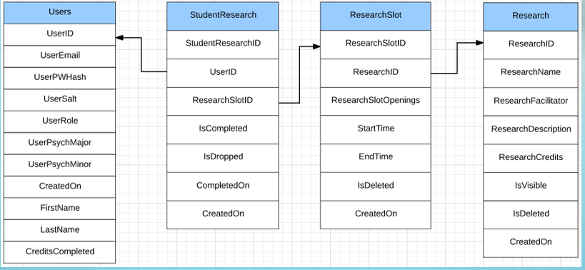
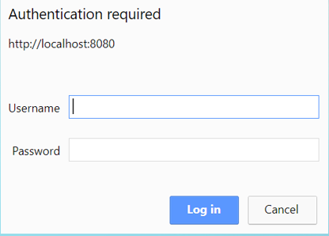
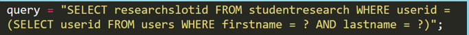
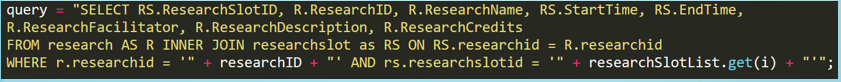
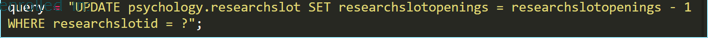

# JSU Psychology Research Web Application

This application keeps track of research participation credits earned by
the Psychology Major and Minor students at JSU.

## Introduction

This project was done as part of our Database course. Project idea was given from Jacksonville State University (JSU) professor Dr. Shannon Robertson. As a group project, we were mainly focusing on how databases can be created using Mysql, and have proper and better relatiobship between databases and tables for teachers, students and administrators. We have created a webinterface for user interaction using java netbeans. It was a challenging task for us, considering the time frame and amount of work we had to put on it. However, we were able to finish it on time. At this time, the webinterface is not alive since it is still on developing mode. But anyone is welcome to clone or download it to thier localmachine and test/imrpove its working. 

## **Site**

The website has 3 types of users; Students, teachers and administrators.
Description about the project

1.  A data base associated with the project is available online.

2.  Only approved faculties can view and modify (ie, data entry) the
    entire database.

3.  Each student can view (but not modify) his or her record. But not
    other student’s records.

4.  The student database has the following information.

    -  Student name and email.

    -  Major in psychology or minor in psychology

    -  Studies participated in.

    -  Total research credits earned.

5.  Students can view and register for available studies.

6.  Researchers an post and modify schedules (Available times ) for each
    study (but their own)

## **Project Structure**

1.  Java servlet hosted on a Tomcat server.

2.  Connected to mySql database.

## **Database Structure**

  

## **Project Flow**

 Login:

- Administrator

- Faculty

- Student

  

### **Administrator**

1.  Functionalities

    1.  -Sees all users data

    2.  -View particular user

2.  Query for all user data

  

3.  Query for researchslotid from searched user

  

### Professor 

Functionality

- Sees only students data

- View particular Student

Functionality currently same as Administrator (Except for user viewing)

### Student

1.  Query to view information about the research the student is currently enrolled in.

  

2.  Query to decrement slot openings for the research that the student just enrolled.

 

  

3.  Query to make new student research record

  

## **Usage**

### **Development**

Want to contribute? Great!

To fix a bug or enhance an existing module, follow these steps:

-   Fork the repo

-   Create a new branch `git checkout -b improve-feature`

-   Make the appropriate changes in the files

-   Add changes to reflect the changes made

-   Commit your changes `git commit -am 'Improve feature'`

-   Push to the branch `git push origin improve-feature`

-   Create a Pull Request

## Credits
-   Dr.Shannon Robertson ( Assistant Professor, Jacksonville State University Psycology Department)
-   Dr. Monica Trifas (Associate Professor of Computer Science, Jacksonville State University)
-   Aaron Branham (Project Member)
-   Joel Branham ( Project Member)

**Bug / Feature Request**

If you find a bug (the website couldn't handle the query and / or gave
undesired results), kindly email me at <jmathew@stu.jsu.edu> by
including your search query and the expected result.
